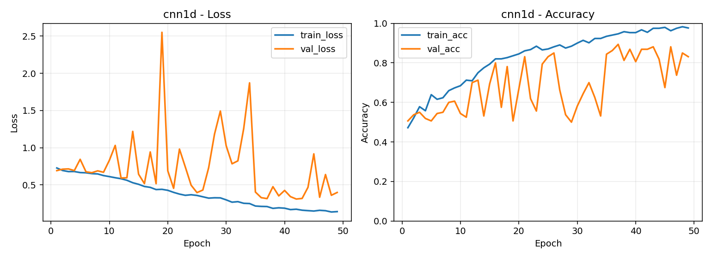
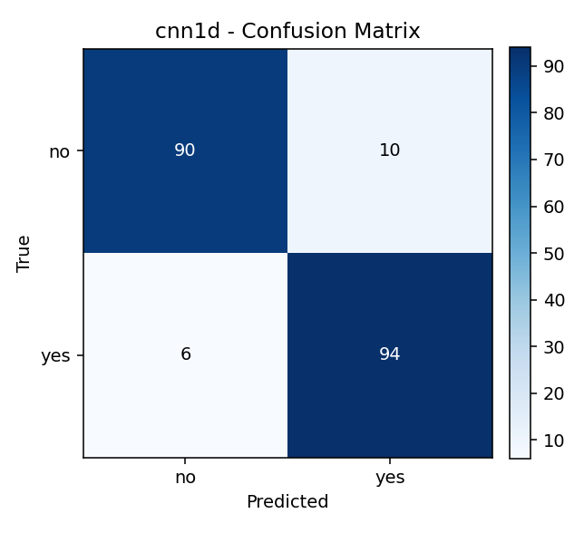
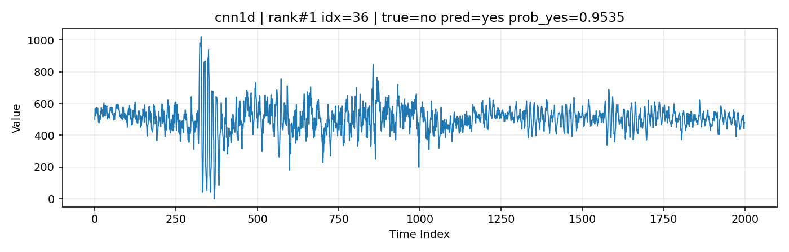
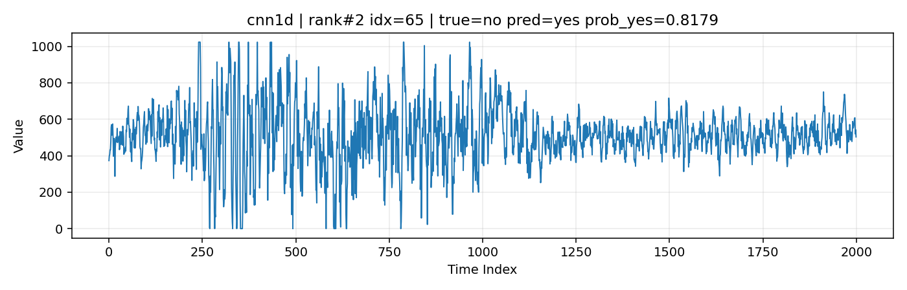

# 螺栓断裂检测实验报告
## 基于一维波形深度学习分类模型

## 摘要
本文面向一维波形二分类任务（No/Yes），在固定数据划分约束下完成了数据读取、模型训练、结果评估、误判分析与实验留档。工程实现并对比了 `CNN1D`、`InceptionTime`、`ConvNeXt1D` 三种模型。当前测试集最优准确率为 **0.9200**（`cnn1d` 与 `inceptiontime` 并列），`convnext1d` 在结构改进与参数调优后提升到 **0.9100**。报告给出训练曲线、混淆矩阵、误判样本分析与可复现实验命令。

## 1 任务与数据集说明
### 1.1 任务定义
任务目标是根据单条一维波形判断螺栓是否断裂，属于二分类问题（No/Yes）。每个样本文件为文本格式，按行存储信号点，常见形式为两列：`index value`，模型使用第二列信号值。

### 1.2 数据规模与划分
- 总样本数：1000（No: 500，Yes: 500）
- 单样本长度：2000
- 外部分割：Train/Test = 0.80/0.20（800/200）
- 训练阶段内部划分：从 Train 中再做 `val_ratio=0.2`（即 640/160）
- 数据路径：`F:/data/newdata`

## 2 实验环境与工程组织
### 2.1 主要环境
- Python 3.11.14
- PyTorch 2.9.1+cu128
- scikit-learn 1.8.0
- NumPy 2.2.6
- Matplotlib 3.10.7

### 2.2 工程目录组织
- 训练入口：`train_binary_classifier.py`
- 报告生成：`generate_assignment_outputs.py`
- 错误样本分析：`generate_error_analysis_report.py`
- 模型权重：`model/<model_name>/best_model.pth`
- 指标输出：`output/<model_name>/metrics.json`
- 对比总表：`output/model_comparison.csv`
- 图表输出：`output/report/figures/`
- 误判输出：`error_analysis/`

## 3 方法设计
### 3.1 预处理与无泄露约束
- 归一化：`zscore`（基于训练子集统计量）
- 样本长度对齐：不足补零、超长截断（长度 2000）
- 训练策略：早停（`patience=12`）、验证集监控
- 无泄露原则：验证集仅由训练集内部划分，测试集不参与训练与调参

### 3.2 模型选择与结构改进
- 基线模型：`cnn1d`
- 时序多尺度模型：`inceptiontime`
- 结构改进模型：`convnext1d`
  - 引入 `LayerNorm1D + DropPath + GRN + AttentionPooling`
  - 在本工程中准确率由 0.52 提升至 0.91

## 4 模型与参数设置
### 4.1 对比模型
- `cnn1d`
- `inceptiontime`
- `convnext1d`

### 4.2 关键参数（实际最优记录）
- `cnn1d`：`lr=1e-3, batch_size=64, dropout=0.3`
- `inceptiontime`：`lr=1e-3, batch_size=64, dropout=0.3`
- `convnext1d`：`lr=3e-4, batch_size=32, weight_decay=5e-5, dropout=0.1, drop_path=0.15`

## 5 实验结果与分析
### 5.1 主结果对比
| 模型 | Test Accuracy | Test Precision | Test Recall | Test F1 | ROC-AUC |
|---|---:|---:|---:|---:|---:|
| CNN1D | 0.9200 | 0.9038 | 0.9400 | 0.9216 | 0.9662 |
| InceptionTime | 0.9200 | 0.9200 | 0.9200 | 0.9200 | 0.9760 |
| ConvNeXt1D（改进后） | 0.9100 | 0.9184 | 0.9000 | 0.9091 | 0.9592 |

来源：`output/model_comparison.csv`

### 5.2 最优模型训练与混淆矩阵
- 训练曲线：`output/report/figures/cnn1d_training_curve.png`
- 测试集混淆矩阵：`output/report/figures/cnn1d_confusion_matrix.png`




### 5.3 鲁棒性评估（当前状态）
当前版本未单独执行分噪声强度鲁棒性曲线实验，因此本节不报告鲁棒性曲线结果。

### 5.4 误判案例
- 误判总表：`error_analysis/tables/error_summary.csv`
- 误判报告：`ERROR_ANALYSIS_REPORT.md`
- 误判图目录：`error_analysis/figures/`




## 6 实验留档与可复现性
已留档文件：
- `output/model_comparison.csv`
- `output/model_comparison.json`
- `output/report/metrics_summary.csv`
- `output/report/assignment_report.md`
- `ERROR_ANALYSIS_REPORT.md`
- `error_analysis/error_analysis_index.json`

复现实验命令：
```bash
python train_binary_classifier.py --data-root F:/data/newdata --model all --epochs 80 --max-retries 3 --target-acc 0.90
python generate_assignment_outputs.py
python generate_error_analysis_report.py
```

## 7 结论
本工程已完成从数据处理、模型训练、对比评估到误判分析与结果留档的完整闭环。当前最优测试准确率为 **0.9200**，`convnext1d` 经改进后达到 **0.9100**。后续建议补充噪声鲁棒性曲线与阈值校准，以进一步提升泛化稳定性。
